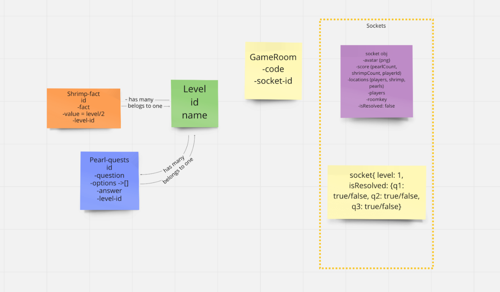

# **One-big-Ocean** 

One-big-Ocean is a web-based multiplayer game that helps players learn about big-O notation by navigating an underwater adventure. By collecting pearls and answering questions, players work together to pass each level before the timer runs out. Shrimp facts can be found along the way for hints and partial points, but at a time cost. If all the levels are passed, then the game is won as a team, while individuals are ranked by pearls and points. The game is built for one to three players, so work solo or as a team to collect the treasures and improve your big-O understanding.

## **Checkout the Deployed Game** 

https://one-big-ocean.herokuapp.com/

## **Playing the Game**

1. Navigate your surroundings + locate precious clams, whose pearls contain ancient queries on big-O notation. 
-Answer correctly + be awarded the pearl. 
-Answer incorrectly, + be forced back to the ocean surface, faced with the lonely sojourn back down. 
2. Don’t forget to keep an eye on the clock. 
3. Every question must be answered correctly to be granted access to the following level. 
4. Need help? Approach a shrimp for a hint. 
-Beware: shrimp are notoriously slow-talkers. If you choose to engage, you’ll be frozen until the shrimp deems you ready to continue. 
-That said, shrimp are also pretty kind, so they may throw you a point or two for your troubles. 
5. Finish with the most points, and win the title of “Mighty O!” 

## **Getting Started from GitHub**

1. Fork and clone this repo.
2. `npm install`
3. Create `big-ocean` and `big-ocean-test` databases.
4. Once you’ve set up the Sequelize models, seed the database by running `npm run seed`
5. Start the build process and your application with: `npm run start-dev`. 
6. In your browser, go to **localhost:3000** and start playing!

## **Contributors**

* Asia Thomas - https://www.linkedin.com/in/amthoms2/
* Isabelle Stettler - https://www.linkedin.com/in/stettlerisabelle/
* Olivia Wong - https://www.linkedin.com/in/oliviawongnyc/
* Sofija Sutton - https://www.linkedin.com/in/sofija-fia-sutton/

## **Technologies**

 Sequelize, Express, PostgreSQL, Phaser.io, Socket.io, Babel, Webpack

## **Schema Design**

## **Future Features & Stretch Goals**

### Users can…
...choose their own sprite

...interrupt other players’ challenges or attack other 
players

...see other player’s score in lose and win scenes

...see a replay game option on end and win scenes

### Game has…
...a tie condition with a starfish collections game 

...shuffles an increased database of 125 questions and facts

...chat function is designed with active avatars, and scrolls to newest messages

### Environment has…
...increased rocks, seaweed, angler fish, piranhas, whales, and sharks

...impact sound effects

## **Attributes**

**Description: Author: Source**

* ScubaDiver Sprite Base: Fellowship Of the Game: https://opengameart.org/content/scuba-diver
* Background SeaScape: pikisuperstar :  <a href="https://www.freepik.com/vectors/background">Background vector created by pikisuperstar - www.freepik.com</a> 
* Clam Base: pch.vector: <a href="https://www.freepik.com/vectors/banner">Banner vector created by pch.vector - www.freepik.com</a> 
* Shrimp Base: macrovector: <a href="https://www.freepik.com/vectors/food">Food vector created by macrovector - www.freepik.com</a>
* Seaweed: macrovector:  <a href='https://www.freepik.com/vectors/food'>Food vector created by macrovector - www.freepik.com</a>  
* LoseScene Background: upklyak: <a href='https://www.freepik.com/vectors/banner'>Banner vector created by upklyak - www.freepik.com</a>

